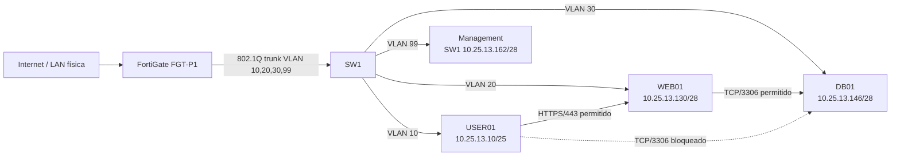
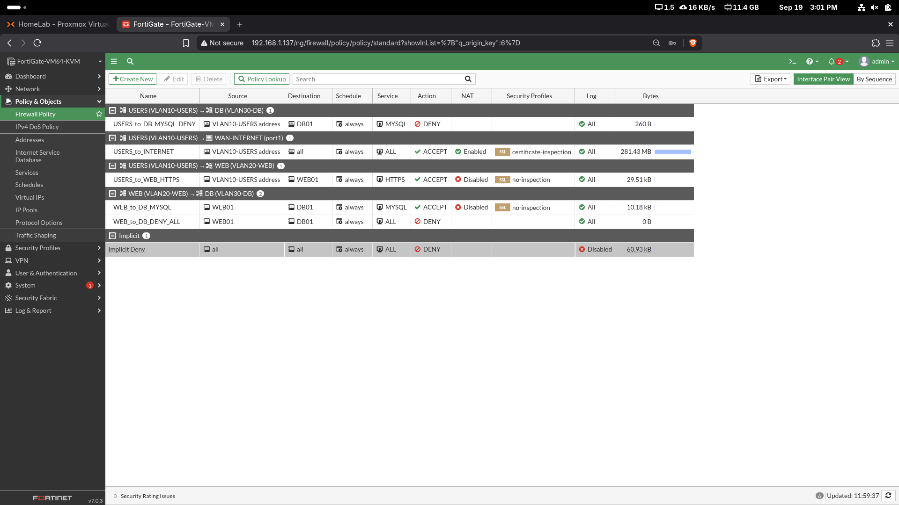
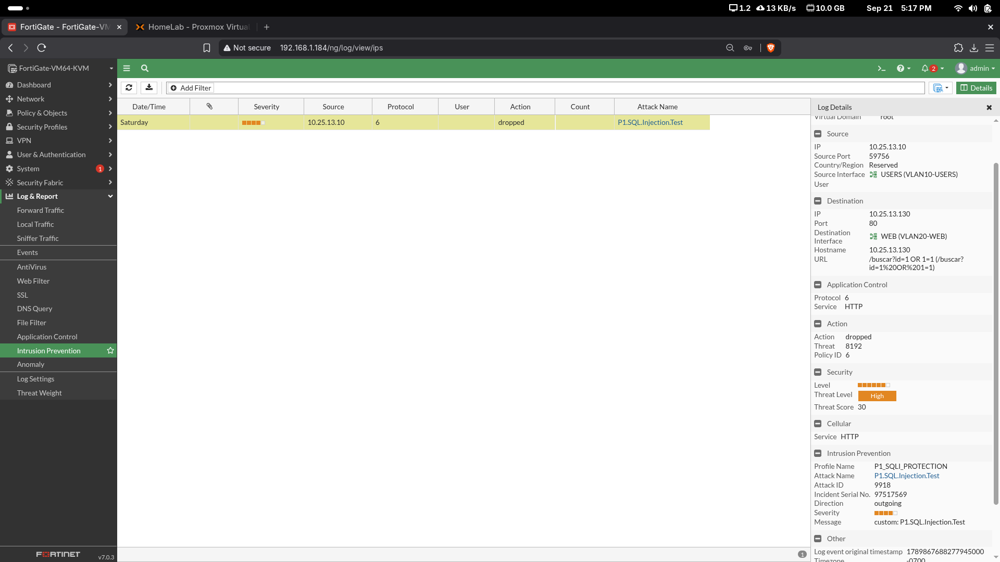
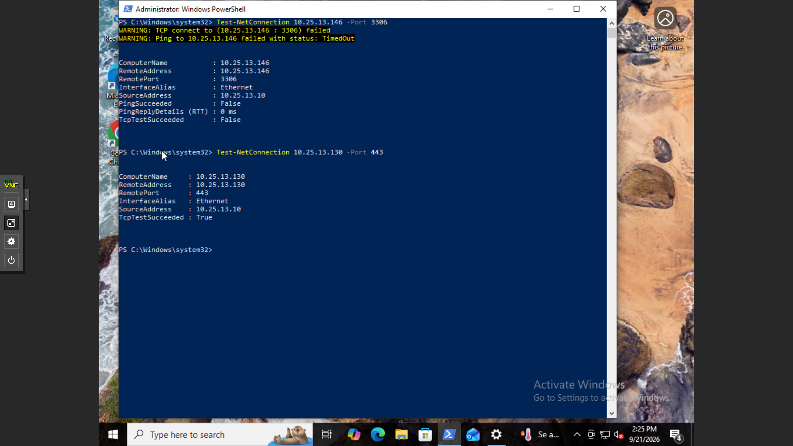

# P1 - Seguridad de Redes con FortiGate

**Matrícula:** 2025-1331

## 🎥 Video demostrativo

**Enlace:** https://youtu.be/EkkunkUPOk0

## Descripción

Este laboratorio implementa una arquitectura de red segmentada con **FortiGate**, un switch Cisco, un cliente de usuarios, un servidor web HTTPS y un servidor de base de datos MariaDB. El objetivo es aplicar controles de seguridad perimetral, segmentación por VLAN, filtrado de tráfico, IPS, mitigación de SQL Injection, bloqueo de archivos ejecutables y protección básica contra DoS.

El direccionamiento principal se deriva de la matrícula **2025-1331**, utilizando el bloque:

`10.25.13.0/24`

## Topología lógica

## Direccionamiento

| VLAN | Nombre | Red | Gateway | Uso |
|---|---|---|---|---|
| 10 | USERS | 10.25.13.0/25 | 10.25.13.1 | Clientes |
| 20 | WEB | 10.25.13.128/28 | 10.25.13.129 | WEB01 |
| 30 | DB | 10.25.13.144/28 | 10.25.13.145 | DB01 |
| 99 | MGMT | 10.25.13.160/28 | 10.25.13.161 | Administración |

**DHCP USERS:** 10.25.13.10 - 10.25.13.120.

## Controles implementados

- VLAN y segmentación interred mediante FortiGate.
- Ruta por defecto y NAT para USERS hacia Internet.
- USERS → WEB01 permitido únicamente por HTTPS/443.
- USERS → DB01 TCP/3306 bloqueado.
- WEB01 → DB01 TCP/3306 permitido.
- WEB01 → DB01 resto del tráfico bloqueado.
- IPS personalizado para detectar SQL Injection.
- Bloqueo y cuarentena del origen atacante.
- File Filter para bloquear descargas de archivos `.exe`.
- Per-IP Traffic Shaper de **2048 Kbps** hacia WEB01.
- IPv4 DoS Policy para `tcp_syn_flood`, acción **Block**, threshold **100**.
- Perfil `custom-deep-inspection` configurado con Full SSL Inspection.

> **Limitación del entorno:** la VM FortiGate Evaluation utilizada permitió configurar el perfil de Deep Inspection, pero no completar una demostración funcional completa de DPI sobre HTTPS. La configuración y su aplicación a la policy están documentadas con evidencias.

## Evidencias principales

## Documentación

- [01 - Propósito](docs/01-proposito.md)
- [02 - Topología](docs/02-topologia.md)
- [03 - Direccionamiento](docs/03-direccionamiento.md)
- [04 - Switch](docs/04-switch.md)
- [05 - FortiGate](docs/05-fortigate.md)
- [06 - Servidores](docs/06-servidores.md)
- [07 - Políticas de seguridad](docs/07-politicas-seguridad.md)
- [08 - Pruebas](docs/08-pruebas.md)
- [09 - Evidencias](docs/09-evidencias.md)

## Archivos técnicos

- `configs/switch/SW1-running-config.txt`
- `configs/switch/SW1-verification.txt`
- `configs/fortigate/FGT-P1-config-summary.txt`
- `configs/web/nginx-https.conf`
- `configs/web/p1-webapp.service`
- `configs/db/50-server.cnf`
- `scripts/web-server/app.py`
- `scripts/db-server/p1_lab_dump.sql`
- `scripts/db-server/setup-user-example.sql`

## Seguridad del repositorio

No se almacenan contraseñas reales, claves privadas, archivos PKCS#12 ni el archivo de entorno de la aplicación. La contraseña de MariaDB se configura localmente y se referencia mediante variables de entorno.
