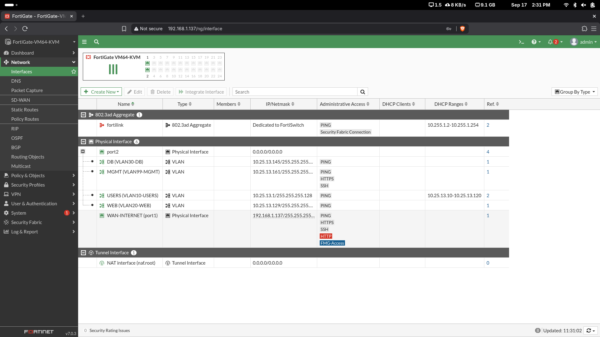

# 02 - Topología

## Diagrama lógico

```mermaid
flowchart TB
    INTERNET[Internet / Red doméstica] -->|port1 / WAN-INTERNET| FGT[FortiGate FGT-P1]
    FGT -->|port2 - trunk 802.1Q| SW1[SW1 - Cisco IOSvL2]

    SW1 -->|Gi0/1 - VLAN 10 USERS| USER01[USER01\n10.25.13.10/25]
    SW1 -->|Gi0/2 - VLAN 20 WEB| WEB01[WEB01\n10.25.13.130/28]
    SW1 -->|Gi0/3 - VLAN 30 DB| DB01[DB01\n10.25.13.146/28]

    FGT --- V10[VLAN10 GW 10.25.13.1]
    FGT --- V20[VLAN20 GW 10.25.13.129]
    FGT --- V30[VLAN30 GW 10.25.13.145]
    FGT --- V99[VLAN99 GW 10.25.13.161]

    SW1 --- MGMT[SVI VLAN99\n10.25.13.162/28]

    USER01 -->|HTTPS 443| WEB01
    WEB01 -->|MySQL 3306| DB01
    USER01 -. bloqueado .->|MySQL 3306| DB01
```

## Componentes

### FortiGate FGT-P1

Actúa como gateway de las VLAN, firewall de capa 3/4, punto de aplicación de perfiles de seguridad y dispositivo de salida a Internet.

- `port1`: WAN-INTERNET.
- `port2`: enlace trunk hacia SW1.
- Subinterfaces VLAN: 10, 20, 30 y 99.

### SW1

Switch Cisco IOSvL2 utilizado para transportar las VLAN y conectar los equipos finales.

- `Gi0/0`: trunk hacia FortiGate.
- `Gi0/1`: access VLAN10 - USERS.
- `Gi0/2`: access VLAN20 - WEB.
- `Gi0/3`: access VLAN30 - DB.
- `Gi1/0-Gi1/3`: puertos no utilizados, administrativamente apagados.

### USER01

Cliente Windows ubicado en VLAN10. Recibe dirección por DHCP y se utiliza para validar conectividad, bloqueos, SQL Injection controlada y filtrado de tráfico.

### WEB01

Servidor Debian con Nginx HTTPS y una aplicación Flask/Gunicorn. Consulta datos de DB01 utilizando TCP/3306.

### DB01

Servidor Debian con MariaDB. El servicio queda enlazado específicamente a `10.25.13.146:3306`.

## Evidencia




