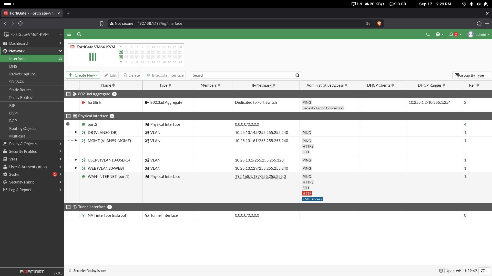

# 03 - Direccionamiento IP

## Bloque principal

El direccionamiento interno del laboratorio utiliza:

```text
10.25.13.0/24
```

## Subredes

| VLAN | Nombre | Subred | Máscara | Gateway |
|---|---|---|---|---|
| 10 | USERS | 10.25.13.0/25 | 255.255.255.128 | 10.25.13.1 |
| 20 | WEB | 10.25.13.128/28 | 255.255.255.240 | 10.25.13.129 |
| 30 | DB | 10.25.13.144/28 | 255.255.255.240 | 10.25.13.145 |
| 99 | MGMT | 10.25.13.160/28 | 255.255.255.240 | 10.25.13.161 |

## Equipos

| Equipo | Dirección | Gateway | VLAN |
|---|---|---|---|
| USER01 | 10.25.13.10/25 | 10.25.13.1 | 10 |
| WEB01 | 10.25.13.130/28 | 10.25.13.129 | 20 |
| DB01 | 10.25.13.146/28 | 10.25.13.145 | 30 |
| SW1 | 10.25.13.162/28 | 10.25.13.161 | 99 |

## DHCP

FortiGate proporciona DHCP a VLAN10-USERS:

```text
Rango: 10.25.13.10 - 10.25.13.120
Gateway: 10.25.13.1
```

USER01 obtuvo `10.25.13.10`.

## WAN

La interfaz WAN utiliza DHCP sobre la red física. Durante la construcción del laboratorio se observaron distintos leases, incluyendo `192.168.1.137` y posteriormente `192.168.1.184`.

La ruta por defecto del FortiGate apunta al gateway físico:

```text
0.0.0.0/0 -> 192.168.1.1
```

Las capturas antiguas donde aparece `192.168.1.137` siguen siendo válidas como evidencia de las subinterfaces VLAN, pero no representan necesariamente el lease WAN más reciente.

## Evidencia


