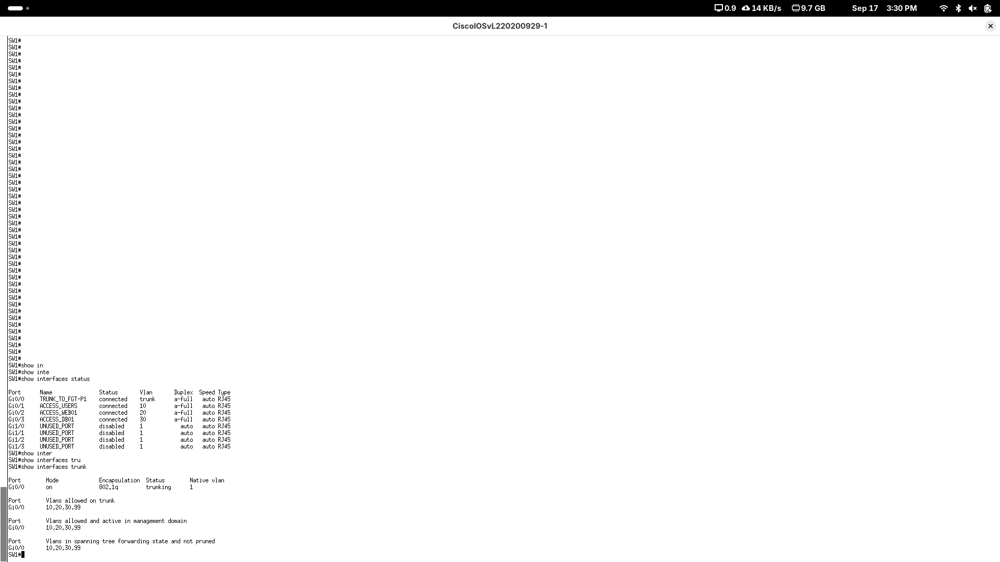

# 04 - Configuración de SW1

## Función

SW1 proporciona conectividad de capa 2 entre FortiGate y los equipos de las VLAN USERS, WEB y DB. También dispone de una SVI de administración en VLAN99.

## VLAN

| VLAN | Nombre | Puerto |
|---|---|---|
| 10 | USERS | Gi0/1 |
| 20 | WEB | Gi0/2 |
| 30 | DB | Gi0/3 |
| 99 | MGMT | SVI de administración |

## Trunk

El puerto `Gi0/0` funciona como trunk 802.1Q hacia FortiGate:

```text
switchport trunk allowed vlan 10,20,30,99
switchport trunk encapsulation dot1q
switchport mode trunk
```

## Seguridad básica

En los puertos de acceso se configuró:

```text
spanning-tree portfast edge
spanning-tree bpduguard enable
```

Esto permite convergencia rápida para hosts finales y protege contra la conexión accidental de dispositivos que envíen BPDUs.

Los puertos `Gi1/0` a `Gi1/3` no utilizados tienen:

```text
description UNUSED_PORT
shutdown
```

También se deshabilitaron los servidores HTTP/HTTPS del switch:

```text
no ip http server
no ip http secure-server
```

## Administración

```text
interface Vlan99
 description MANAGEMENT
 ip address 10.25.13.162 255.255.255.240

ip default-gateway 10.25.13.161
```

La SVI VLAN99 fue validada en estado `up/up`.

## Archivos

- [Running-config](../configs/switch/SW1-running-config.txt)
- [Verificación VLAN/trunk](../configs/switch/SW1-verification.txt)

## Evidencia


