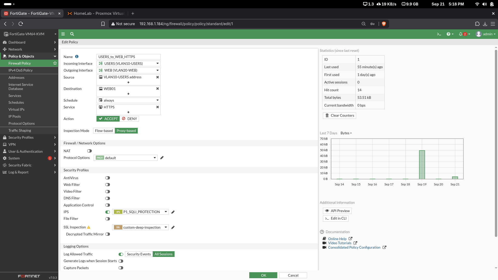

# 05 - Configuración de FortiGate

## Rol

FortiGate es el componente central de seguridad del laboratorio. Realiza routing inter-VLAN, NAT hacia Internet, filtrado por políticas y aplicación de perfiles de seguridad.

La configuración del equipo se realizó mediante la **GUI**, conforme al requisito de la práctica.

## Interfaces VLAN

| Interfaz | VLAN ID | Dirección |
|---|---:|---|
| VLAN10-USERS | 10 | 10.25.13.1/25 |
| VLAN20-WEB | 20 | 10.25.13.129/28 |
| VLAN30-DB | 30 | 10.25.13.145/28 |
| VLAN99-MGMT | 99 | 10.25.13.161/28 |

Todas utilizan `port2` como interfaz física padre.

## Ruta por defecto

```text
Destination: 0.0.0.0/0
Gateway:     192.168.1.1
Interface:   WAN-INTERNET (port1)
```

## NAT

La policy `USERS_to_INTERNET` utiliza NAT de salida para que VLAN10 pueda acceder a Internet.

## Políticas principales

| Política | Origen | Destino | Servicio | Acción | NAT |
|---|---|---|---|---|---|
| USERS_to_DB_MYSQL_DENY | VLAN10-USERS | DB01 | MYSQL | DENY | No |
| USERS_to_INTERNET | VLAN10-USERS | WAN | ALL | ACCEPT | Sí |
| USERS_to_WEB_HTTPS | VLAN10-USERS | WEB01 | HTTPS | ACCEPT | No |
| WEB_to_DB_MYSQL | WEB01 | DB01 | MYSQL | ACCEPT | No |
| WEB_to_DB_DENY_ALL | WEB01 | DB01 | ALL | DENY | No |

## IPS y SQL Injection

Se creó el sensor `P1_SQLI_PROTECTION` con la firma personalizada:

```text
P1.SQL.Injection.Test
```

La firma identifica el patrón de laboratorio `OR 1=1` dentro del URI HTTP. Durante la prueba controlada, FortiGate registró:

- Source: `10.25.13.10`
- Destination: `10.25.13.130`
- Action: `dropped`
- Severity: `High`
- Profile: `P1_SQLI_PROTECTION`

También se configuró cuarentena temporal del origen durante 5 minutos.

## SSL/SSH Inspection

Se configuró `custom-deep-inspection` con:

- Multiple Clients Connecting to Multiple Servers.
- Full SSL Inspection.
- CA: `Fortinet_CA_SSL`.
- HTTPS/443 habilitado.

El perfil se asignó a `USERS_to_WEB_HTTPS`.

### Limitación observada

La VM **FortiGate Evaluation** utilizada no permitió completar una demostración funcional completa de DPI sobre el tráfico HTTPS del laboratorio. Por indicación del ejercicio, se conserva y documenta la configuración aplicada, aunque la limitación de licencia impidió demostrar todo el flujo de descifrado/inspección.

## Archivo de configuración

Por seguridad no se publica el backup completo del FortiGate, ya que puede contener material criptográfico interno. En su lugar se incluye:

- [Resumen sanitizado de configuración](../configs/fortigate/FGT-P1-config-summary.txt)

## Evidencias



