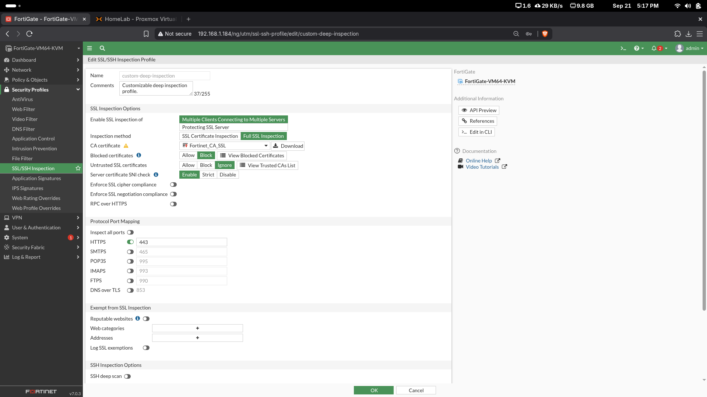

# 07 - Políticas y controles de seguridad

## Matriz de acceso

| Flujo | Servicio | Resultado |
|---|---|---|
| USERS → Internet | ALL | Permitido con NAT |
| USERS → WEB01 | HTTPS/443 | Permitido |
| USERS → DB01 | MySQL/3306 | Bloqueado |
| WEB01 → DB01 | MySQL/3306 | Permitido |
| WEB01 → DB01 | Cualquier otro | Bloqueado |

Esta matriz implementa mínimo privilegio entre las zonas del laboratorio.

## IPS contra SQL Injection

Perfil:

```text
P1_SQLI_PROTECTION
```

Firma personalizada:

```text
P1.SQL.Injection.Test
```

Patrón de prueba:

```text
OR 1=1
```

Acción configurada: bloqueo y cuarentena temporal.

El log muestra la petición controlada hacia:

```text
http://10.25.13.130/buscar?id=1 OR 1=1
```

con resultado `dropped`.


## File Filter

Perfil:

```text
P1_BLOCK_EXE
```

Configuración relevante:

- Protocol: HTTP.
- Direction: Both.
- File Type: exe.
- Action: Block.

Se utilizó un archivo inofensivo de laboratorio denominado `P1-Test.exe`. FortiGate registró el evento como `blocked`.


## Rate limiting

Se creó un **Per-IP Shaper**:

```text
Name: P1_WEB_RATE_LIMIT
Maximum bandwidth: 2048 Kbps
```

El control está destinado al tráfico HTTPS de USERS hacia WEB01.


## Protección DoS

Policy:

```text
P1_WEB_DOS_PROTECTION
```

Parámetros principales:

```text
Incoming: VLAN10-USERS
Destination: WEB01
Service: HTTPS

tcp_syn_flood:
  Logging: Enable
  Action: Block
  Threshold: 100
```


## Deep Inspection

El perfil `custom-deep-inspection` se configuró con Full SSL Inspection y se aplicó a `USERS_to_WEB_HTTPS`.



La VM Evaluation utilizada limitó la demostración funcional completa del DPI sobre HTTPS, pero la configuración requerida quedó creada y documentada.

## Logging

Las policies y perfiles de seguridad utilizados en las pruebas registran eventos para validar:

- Tráfico permitido y denegado.
- Eventos IPS.
- Cuarentena.
- Bloqueo de archivos.
- Comunicación WEB01 → DB01.
