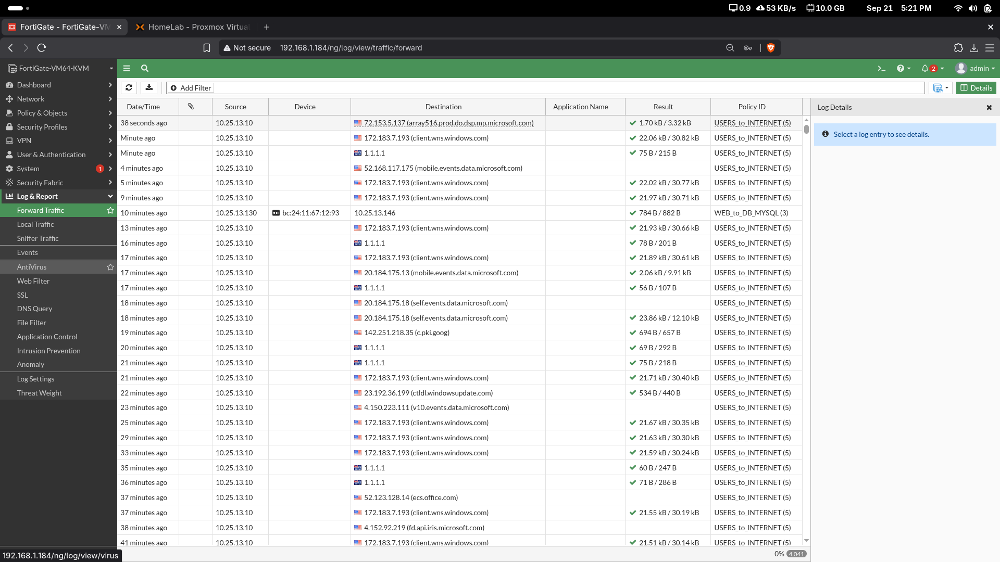
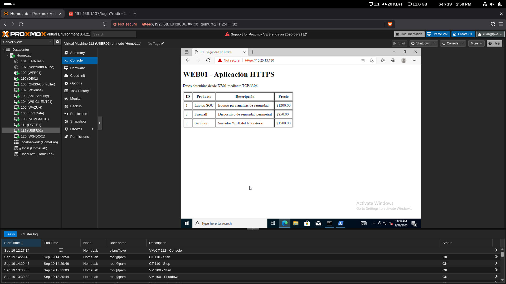
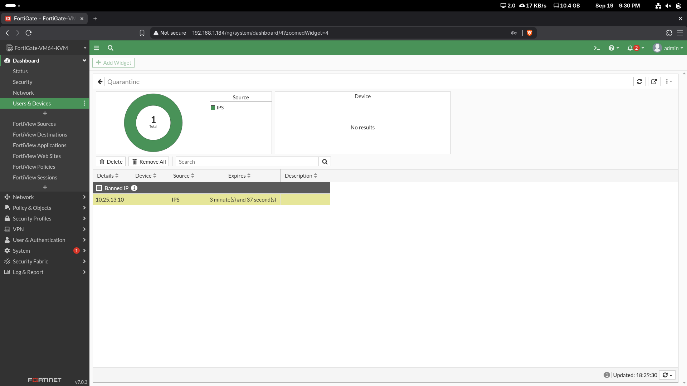
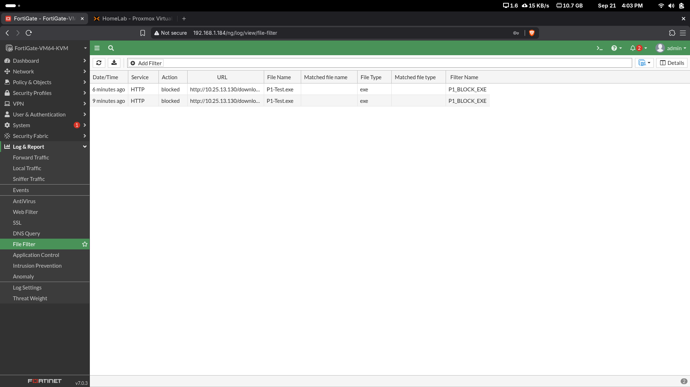
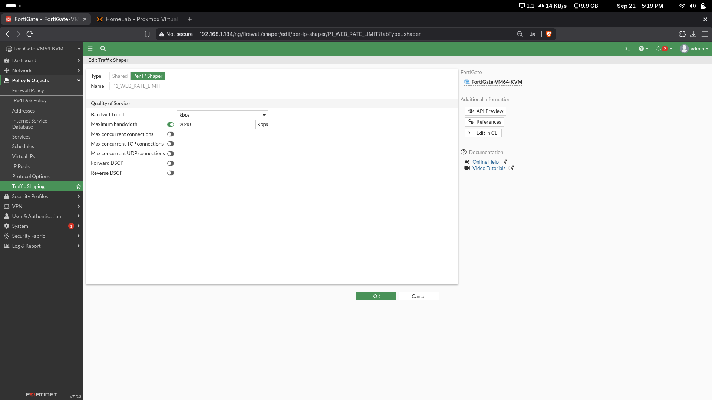
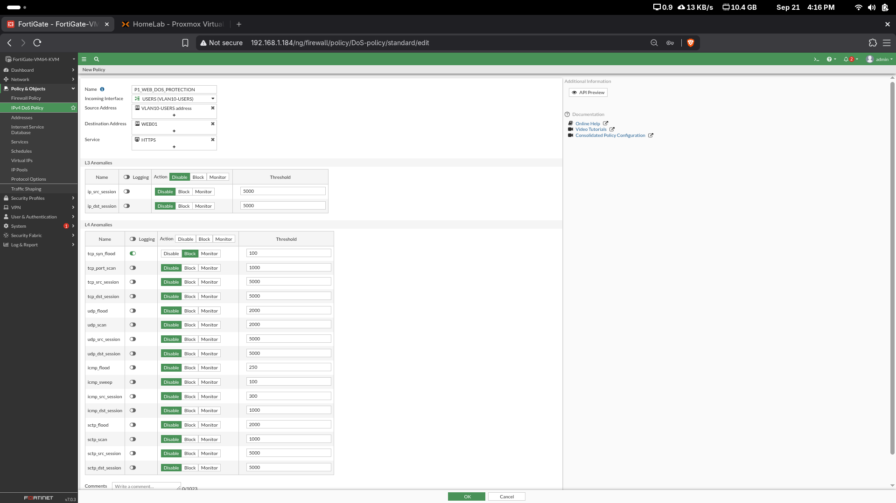

# 08 - Pruebas y validación

## 1. USERS → WEB01 HTTPS

Desde USER01:

```powershell
Test-NetConnection 10.25.13.130 -Port 443
```

Resultado:

```text
TcpTestSucceeded : True
```

**Conclusión:** la policy `USERS_to_WEB_HTTPS` permite correctamente HTTPS/443.

## 2. USERS → DB01 MySQL

Desde USER01:

```powershell
Test-NetConnection 10.25.13.146 -Port 3306
```

Resultado:

```text
TcpTestSucceeded : False
```

**Conclusión:** el acceso directo USERS → DB01 TCP/3306 está bloqueado.


## 3. WEB01 → DB01 MySQL

La aplicación web recuperó correctamente datos desde DB01 a través de TCP/3306.

El log de FortiGate muestra tráfico:

```text
Source: 10.25.13.130
Destination: 10.25.13.146
Policy: WEB_to_DB_MYSQL
```



## 4. Aplicación HTTPS

Desde USER01 se accedió a:

```text
https://10.25.13.130
```

La aplicación mostró los registros de `p1_lab.productos`.



## 5. SQL Injection controlada

Se utilizó el endpoint de laboratorio:

```text
/buscar?id=1 OR 1=1
```

FortiGate generó el evento:

```text
Attack Name: P1.SQL.Injection.Test
Action: dropped
Threat Level: High
Source: 10.25.13.10
Destination: 10.25.13.130
```


## 6. Cuarentena

Después de la detección, FortiGate colocó `10.25.13.10` en cuarentena temporal por IPS.



## 7. Bloqueo de .exe

Se intentó descargar un archivo de prueba `P1-Test.exe`.

FortiGate registró:

```text
Action: blocked
File Type: exe
Filter: P1_BLOCK_EXE
```



## 8. Rate limiting

Se validó la existencia del Per-IP Shaper `P1_WEB_RATE_LIMIT` con límite máximo de `2048 Kbps`.



## 9. DoS Policy

Se verificó la policy `P1_WEB_DOS_PROTECTION` con detección de `tcp_syn_flood`, threshold `100`, logging y acción `Block`.



## Resultado general

Las pruebas demuestran la segmentación de la red, el acceso mínimo necesario entre zonas y el funcionamiento de los principales mecanismos de seguridad configurados. La única excepción funcional corresponde al DPI completo sobre HTTPS, cuya configuración fue realizada pero su demostración quedó limitada por la VM Evaluation de FortiGate utilizada.
